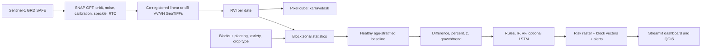

# Sugarcane Anomaly Early Warning System Using Sentinel-1 RVI Time Series

A production-oriented foundation for block and pixel-level sugarcane monitoring from dual-polarized Sentinel-1 SAR. It computes `RVI = 4*VH/(VV+VH)` from **linear** backscatter, learns healthy curves by age/variety/crop type, scores departures, exports QGIS-ready products, and presents results in Streamlit.

## Architecture and data flow



## Critical assumptions

1. Do not mix ascending/descending passes, incidence-angle regimes, calibration conventions, or grids in one baseline without explicit normalization/stratification.
2. SNAP/Sentinel Hub-style products may be linear or dB. Set `raster.input_units` correctly. The calculation converts dB with `10**(dB/10)`.
3. RVI alone identifies departures, not definitive causes. Irrigation, rainfall, scouting, soil, harvest and management data are needed for diagnosis.
4. Baselines must only use quality-controlled healthy seasons, matched by crop age, variety, plant/ratoon class, estate and preferably orbit.
5. Validate alerts spatially and temporally before operational decisions.

## Data layout

- `data/raw/vv/YYYY-MM-DD_VV.tif`, `data/raw/vh/YYYY-MM-DD_VH.tif`: paired, aligned, calibrated backscatter.
- `data/vectors/blocks.gpkg`: polygon layer with unique `block_id`, estate, variety, crop_type, planting/harvest dates.
- `data/metadata/observations.csv`: one row per block/date. See template.
- `outputs/rasters`: continuous RVI and categorical risk GeoTIFFs.
- `outputs/vectors`: GPKG, GeoJSON, Shapefile.
- `outputs/reports`: CSV baseline, block report, alerts.

## Install

Recommended: Miniforge/Mambaforge and Python 3.11.

```bash
micromamba create -f environment.yml
micromamba activate sugarcane-rvi
python -m pip install -e .
pytest -q
```

SNAP is separate. Install ESA SNAP with Sentinel-1 Toolbox, build/export an XML graph, and call `run_snap_gpt`. The graph should apply orbit metadata, thermal/border noise removal, calibration to sigma0 or gamma0, optional Refined Lee filtering, radiometric terrain flattening where appropriate, Range-Doppler terrain correction, and GeoTIFF export.

## Run

```bash
cp data/metadata/observations_template.csv data/metadata/observations.csv
python main.py
streamlit run dashboard.py
```

Use `notebooks/Sugarcane_RVI_Early_Warning.ipynb` for a cell-by-cell workflow, including a synthetic smoke test, heat map, GeoTIFF creation and notebook download link.

## Database schema for scale

Recommended PostgreSQL/PostGIS tables: `estates(estate_id, name, geom)`, `blocks(block_id, estate_id, variety, crop_type, planting_date, harvest_date, geom)`, `acquisitions(acquisition_id, sensing_time, orbit, direction, vv_uri, vh_uri, processing_version)`, `block_observations(block_id, acquisition_id, crop_age_days, rvi_mean, rvi_std, valid_pixels, rainfall_mm, irrigation_mm)`, `baselines(model_id, estate_id, variety, crop_type, orbit, age_bin, mean_rvi, std_rvi, n, version)`, `anomalies(block_id, acquisition_id, method, score, risk, affected_area_pct, model_version)`, `alerts(alert_id, block_id, acquisition_id, message, status, created_at)`. Put raster objects in object storage and save URIs/metadata in PostGIS.

## Models

- Rules: directly interpretable percent/z thresholds.
- Rolling trend: persistence and growth-rate departure.
- Isolation Forest: unsupervised multivariate outliers.
- Random Forest: supervised only after reliable field labels exist.
- LSTM: optional sequence autoencoder for sufficiently large, regularly sampled data; do not use as the first production model.

Track RMSE, MAE and R2 for healthy-curve prediction; precision, recall, F1 and ROC-AUC for labeled anomaly detection. Split validation by season and preferably estate to avoid temporal/spatial leakage.

## Production deployment

Schedule preprocessing and scoring with Airflow/Prefect, store GeoTIFFs as cloud-optimized GeoTIFFs in object storage, store features in PostGIS/Parquet, version baselines/models with MLflow, and expose the dashboard behind authentication. Add data-quality checks for missing dates, polarization mismatch, CRS/grid mismatch, implausible RVI, nodata proportion and processing-version drift.

## QGIS

Add `outputs/rasters/latest_risk.tif`; its embedded palette is 0 green, 1 yellow, 2 orange, 3 red, 4 dark red. Use nearest-neighbour rendering. Load `block_status.gpkg` for tables and labels.
